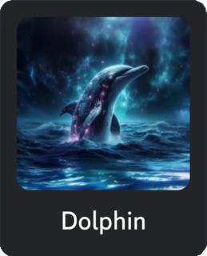

[](https://huggingface.co/cognitivecomputations)
[](https://discord.gg/tCMkMDDHwm)

# Cognitive Computations: Dolphin ΔI B Ø T

Discord bot for Cognitive Computations server, designed to expose and explore models and provide interactive experience for users.

## Features

- **Model Exposition:** Dolphin ΔI Bot allows users to interact with and explore various cognitive models, fostering a better understanding of Cognitive Computations.
- **Interactive Experiences:** Engage users with interactive experiences and activities powered by cutting-edge Cognitive Computations technologies.
- **Customizable Settings:** Tailor the bot's behavior to suit Cognitive Computations server needs through a variety of customizable settings.

## Installation

To add Dolphin ΔI Bot to your Discord server, follow these simple steps:
1. Create the .env file and set the env variables:
```sh
echo "DISCORD_TOKEN=<discord-token>

MODEL_FILE=<model-filename>
MODEL_NAME=<model-label>
MODEL_PATH=<model-path>

DOLPHIN_GPU_LAYERS=<gpu-layers>
DOLPHIN_NTHREADS=<number-threads>
DOLPHIN_SYSTEM_PROMPT=<system-prompt>
DOLPHIN_EMBED_URL=<link>
DOLPHIN_EMBED_IMG=<image>
DOLPHIN_CMD_SCOPE=<server>
DOLPHIN_CMD_CHANNEL=<channel>
DOLPHIN_MAX_REQ=<max-req>" > .env
```
2. Install packages using poetry:
```sh
poetry install
```
For CUDA first install toolkit and then:
```sh
CMAKE_ARGS="-DLLAMA_CUBLAS=on" poetry install
```
3. Start bot:
```sh
poetry run python src/main.py
```

## Usage

Once Dolphin ΔI Bot is installed on your server, you can start using its features:

## Contributing

If you would like to contribute to the development of Dolphin ΔI Bot, please follow the guidelines outlined in [CONTRIBUTING.md](CONTRIBUTING.md).

We welcome contributions in the form of bug reports, feature requests, code improvements, and more.

## License

Dolphin ΔI Bot is licensed under the [MIT License](LICENSE). See the [LICENSE](LICENSE) file for more details.